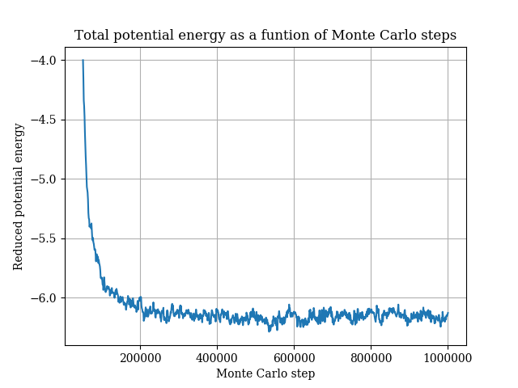
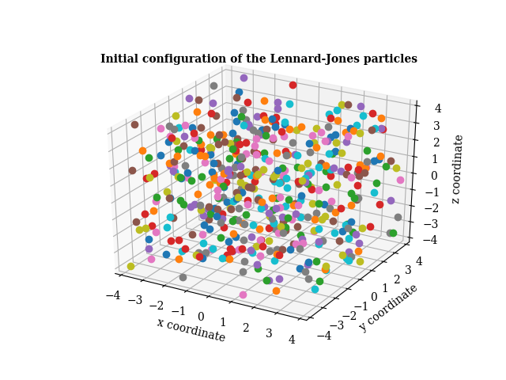

# final-project-swe4s_mclj


## Description
This is a repository for the final project of the course Software Engineering for Scientists (CSCI 7000) at CU Boulder, of which the goal is to develope a software package able to perform a Monte Carlo simulation of Lennard-Jones particlees in canonical ensembles. The repository includes the following files:
- `monte_carlo.py`: The main program of the package, which is able to perform a Monte Carlo simulation of Lennard Jones particles given specified parameters. 
- `test_monte_carlo.py`: The unit tests of `monte_carlo.py`.
- `test_monte_carlo.py`: The funtinoal tests of `monte_carlo.py`.
- `energy.py`: A Python library which include several models and methods for energy calculations. 
- `test_energy.py`: The unit tests of `energy.py`.
- `test_energy.sh`: The functional tests of `energy.py`.
- `plot_energy.py`: The code for plotting the total energy of the system as a function of Monte Carlo step.
- `test_plot.energy.sh`: The funtional tests of `plot_energy.py`.
- `results`: A folder containing all the datasets and the results of analysis.
    - `result.txt`: STDOUT of `python monte_carlo.py -p`.
    - `structure_initial.png`: A figure of the initial configuration of the system which was generated by the command `python monte_carlo.py -p`.
    - `structure_final.png`: A figure of the final configuration of the system which was generated by the command `python monte_carlo.py -p`.
    - `traj_output.xyz`: The trajectory data file generated by `python monte_carlo.py -p`, which can serve as the input dataset of VMD for molecular visualization.
    - `traj.gif`: A gif file generated by VMD given the trajectory data file.
    - `energy_plot.png`: The plot of total potential energy as a function of Monte Carlo step generated by the command `python plot_energy.py -i results/result.txt`.

#### Requirements fulfilled
Throughout the development, to apply and extend the knowledge learned from the course, all the following requirements are fulfilled:

- The software development follows the best practices of GitHub workflow and test-driven development (TDD).
- All the python codes conform with PEP8 coding style.
- All the Python modules have their own corresponding unit tests and functional test.
- Continuous integration was performed using Travis CI.
- Benchmarking and profiling were performed to compare the computational costs of using different data strcutre, either a Numpy array or a dictionary, which is the implementation of hash tables in Python.

#### The scieintific goals of the project
The major goal of this software package, is to perform a Monte Carlo simulation of Lennard-Jones particles in canonical (NVT) ensembles, and compare the result with [ the benchmark provided by NIST](https://mmlapps.nist.gov/srs/LJ_PURE/mc.htm), which provides the resulting potential energy of the system given different reduced temperatures and reduced densities. In the simulation, $500$ particles were placed randomly in the box such that the reduced density ($\rho^{*}$) was $0.9$. The reduced temperature ($T^{*}$) was set as $0.9$ to compare with one of the benchmarks. Due to the limitation of time and computation cost, we ran the simulation for 1 million steps, which should be enough to produce a result comparable to NIST benchmark, which required 250 million steps in the production simulation. In addition to an animated trajectory generated by [Visual Molecular Dynamics (VMD)](https://www.ks.uiuc.edu/Research/vmd/), the initial and final configuration of the system will be visualized the demonstrate the concept of a Mone Carlo simulation. Note that the parameters such as the reduced temperature and reduced density are allowed to be changed flexibily using different flags. 


## Installation
All the Python scripts are written in Python 3 and teh packages required to run the codes (including the unit tests and functional tests) inlcude: `os`, `sys`, `abc`, `time`, `numpy`, `argparse`, `unittest`, `matplotlib`, and `pycodestyle`. Execute the following command to use this package:
```
git clone https://github.com/cu-swe4s-fall-2019/final-project-swe4s_mclj.git
```


## Usage
#### Execution of the main program: `monte_carlo.py`
To perform a Monte Carlo simulation of Lennard-Jones particles in a canonical ensemble, run `python monte_carlo.py` with the following flags:
- `-N`: The number of particles in the simulation box. Default: 500.
- `-T`: The reduced temperature. Ranges from 0 to 1. Default: 0.9.
- `-r`: The reduced density of the particles. Ranges from 0 to 1. Default: 0.9.
- `-n`: The number of Monte Carlo steps. Default: 1M.
- `-fe`: The output frequency of energy as the STDOUT. Default: 1000.
- `-ft`: The output frequency of the trajectory data. Default: 1000.
- `-m`: The initial maximum of the displacement. Default: 0.1.
- `-e`: The energy function used to calculate the interactions between the particles in the fluid Default: "UnitlessLJ".
- `-p`: whether to plot the initial and the final configuration of the particles.

#### Unit tests and funtional tests
- To perform unit tests of `monte_carlo.py`, run `python test_monte_carlo.py`.
- To perform funtional tests of `monte_carlo.py`, run `bash test_monte_carlo.sh`.
- To perform unit tests of `energy.py`, run `python test_energy.py`.
- To perform funtional tests of `energy.py`, run `bash test_energy.sh`.

## Enhancement of the code efficiency
To improve the efficiency of our code, we used `cProfile` pacakge to perform profiling on `monte_carlo.py` with the following command:
```
python3 -m cProfile -s tottime monte_carlo.py -N 20 -n 100000
```
which gave rise to the following results:
```
65234309 function calls (61272000 primitive calls) in 81.529 seconds

Ordered by: internal time

ncalls  tottime  percall  cumtime  percall filename:lineno(function)
3800190   20.090    0.000   20.090    0.000 energy.py:92(calc_energy)
```
As shown above, the function `calc_energy` accounted for about 26.4% of the computer time, which was therefore what we wanted to improve on. The reason behind this was that the computational cost was quadratically proportional to the number of particles and that the distances and neighbors of every particle updated after each Monte Carlo step. To speed up the execution of this function, we tried to use a dictionary, which was an implementation of hash tables in Python, as the cache to store the values of energy corresponding to different interparticle distances ($r$). After implementing the Python dictionary, we obtained the following results of another profiling:
```
69034583 function calls (65072274 primitive calls) in 74.539 seconds

Ordered by: internal time

ncalls  tottime  percall  cumtime  percall filename:lineno(function)
3800190   13.387    0.000   13.855    0.000 energy.py:92(calc_energy)
```
As shown above, the computer time of executing `calc_energy` decreased to 13.855, which means that the new data structure (hash table) was 1.449799197 faster than the original data structure (2D array).

## Results
#### Total potentail energy of the system
As a results, after 1 million Monte Carlo steps, the total potential energy of the system averaged the last 100000 steps is -6.1616, which is pretty close to the NIST benchmark (-6.1773). From the plot of energy as a function of Monte Carlo step as shown below, we can also see that the total reduced potential energy decreased very rapidly and converged to values around -6.1 given a moderate amount of Monte Carlo steps.

<p align="center">
     <br/>
</p>

#### Molecular visualization of the system configurations
Using `matplotlib`, we were able to plot the initial and the final configuration of the system in a 3D space. As shown below, while it seems hard to tell the difference between the two since all the particles were randomy placed, we can still observe that the in the figure on the right, the particles were distributed more uniformly than the other. This just shows that the final configuration of the system on the right still represents a configuration that is much more stable than the one shown on the left.

 

To better observe the tendency of the particles being distributed more uniformly, we also tried to place the particles randomly in a space smaller than the whole box. Specifically, we placed the particles in a smaller cubic box whose box length is half of the original one. For demonstration purposes, we changed the maximum displacement to 0.2 to make the diffusion more obvious. (Also, the output frequency of the trajectory data and the number of Monte Carlo steps were changed to 5 steps and 10000 steps, respectively.) Below are the initial and the final conigurations of the system. As could be easily expected, to reach to a more stable thermodynamic state, namely, a state with a lower total potential energy of the system, the particles diffused toward the sides of the box and were distributed more uniformly. 

 


#### Animated trajectory
In addition to the calculation of total potential energy of the system, we also used Visual Molecular Dynamics (VMD) to visualize the trajectory of the particles. As shown below, the left animation illustrates the simulation starting with particles randomly placed in the full space of the box, while the right one shows the simulation starting with particles randomly placed in a smaller space of the box as decribed above (only the first 2500 steps were plotted). As expected, both simulations drove the system to a lower energy. For the simulation starting with a small space, the particles diffuse to the sides of the box and it took more steps for the energy of the system to converge. 
 


## Authors
- Wei-Tse Hsu ([wehs7661@colorado.edu]())
- Chi-Ju Wu ([chwu5235@colorado.edu]())